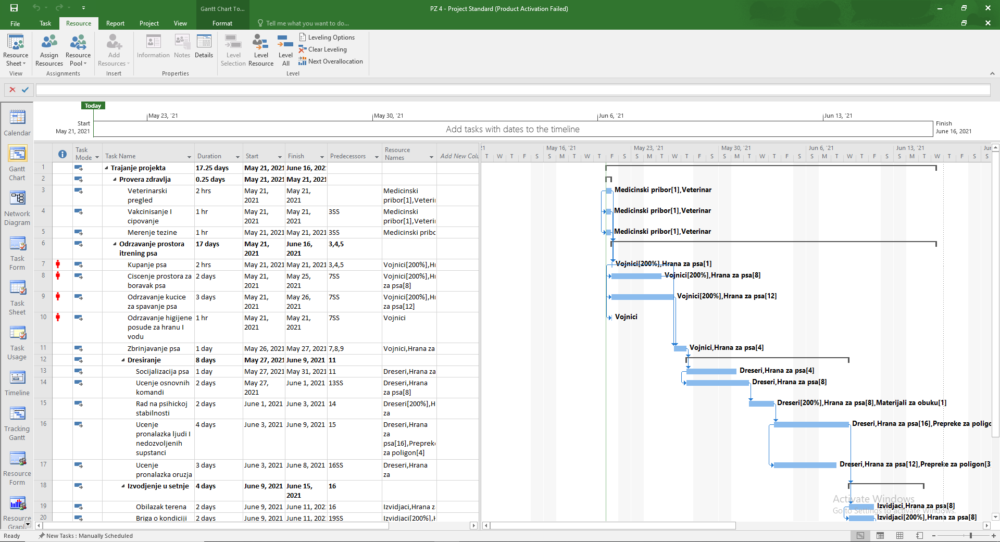
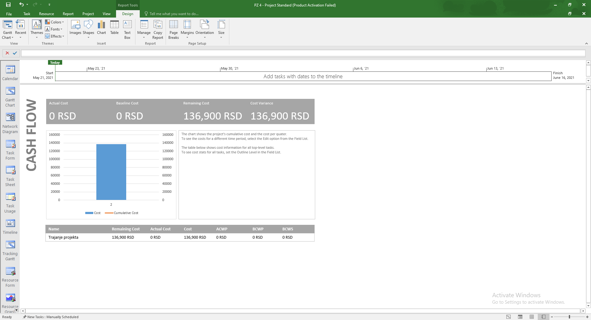
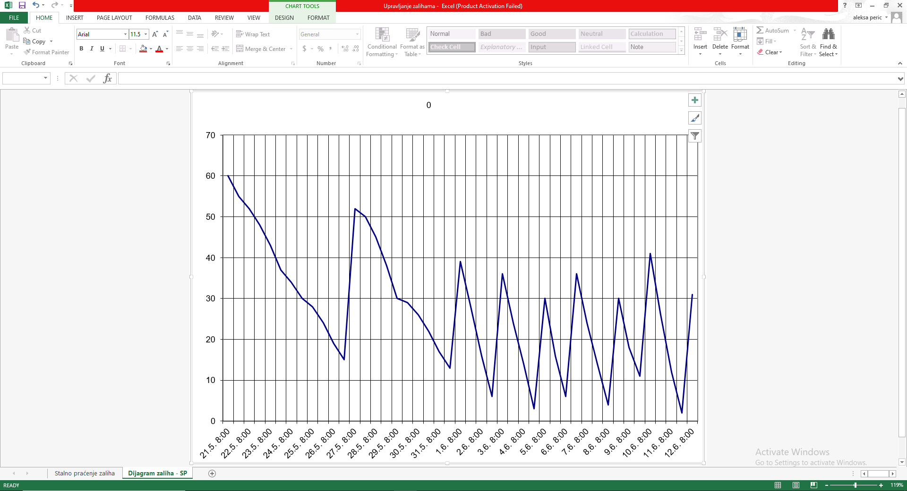

# Mrežno planiranje

Projekat u okviru kursa Operaciona istraživanja 2, Fakultet organizacionih nauka, Univerzitet u Beogradu.

Primenom mrežnog planiranja organizovan je proces dresiranja pasa za vojne potrebe.

Projekat je implementiran u softveru za upravljanje projektima *Microsoft Project*. Napravljen je plan projekta sa zadatim brojem aktivnosti. Urađeno je predviđanje potrebnih resursa za realizaciju određenog procenta projektnih aktivnosti, kao i plan nabavke resursa u periodu realizacije projekta na osnovu šablona za upravljanje zalihama. Revidiran je plan projekta i izvršena nivelacija resursa tako da se projekat završi za minimalno vreme i uz minimalne troškove. Upoređeni su početni i revidirani plan projekta.

Kompletni rezultati projekta su dostupni u [rezimeu rada](./Rezime%20rada.pdf).

## Plan aktivnosti

## Prekoračenja troškova

## Količina zaliha kroz vreme

 
